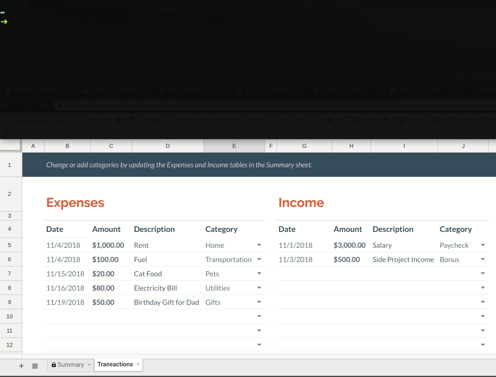

# budget-cli


## Preliminaries
 1. Create a *monthly budget* spreadsheet from the [spreadsheet template gallery](https://docs.google.com/spreadsheets/u/0/?ftv=1&folder=0ACoSgW1iveL-Uk9PVA) if you don't already have one.

 2. Optionally, create an additional *annual budget* spreadsheet if you want to use the synchronization feature.

 3. Take note of the URL or just the **`SPREADSHEET_ID`** from your new spreadsheet(s):
``` cmd
https://docs.google.com/spreadsheets/d/<SPREADSHEET_ID>/edit#gid=<SHEET_ID>
```

## Installation
 1. Complete steps 1 & 2 of the [quickstart guide](https://developers.google.com/sheets/api/quickstart/python). Make sure that you copy the **`credentials.json`** file into **project directory.**

 2. From project directory:
``` sh
./install.sh
```

## Uninstallation
From project directory:
``` sh
./uninstall.sh
```

## Configuration
The configuration file `~/.config/budget-cli/config.json` is created during installation. You should configure the following parameters before using the app:

 * **`num-expense-categories:`** Number of expense categories in monthly budget spreadsheet.
 * **`num-income-categories:`** Number of income categories in monthly budget spreadsheet.
 * **`max-rows:`** Maximum number of rows in any spreadsheet.

#### Important
 * For synchronization, expense/income **categories must be exactly the same** across monthly and annual budget spreadsheets.
 * It is recommended **not to modify** `monthly-budget-id` and `annual-budget-id` manually, since there are dedicated commands for that.

## Usage
### Spreadsheet Selection
``` sh
# print selected monthly spreadsheet ID
budget mid

# print selected annual spreadsheet ID
budget aid

# select monthly spreadsheet by ID
budget mid <SPREADSHEET_ID>

# select annual spreadsheet by ID
budget aid <SPREADSHEET_ID>

# select monthly spreadsheet by URL
budget murl <SPREADSHEET_URL>

# select annual spreadsheet by URL
budget aurl <SPREADSHEET_URL>
```

### Monitoring
``` sh
# print monthly budget summary
budget summary

# log monthly budget transaction history
budget log
```

### Transaction Entry
``` sh
# append expense for custom date
budget expense "<Date>,<Amount>,<Description>,<Category>"

# append expense for today
budget expense "<Amount>,<Description>,<Category>"

# append income for custom date
budget income "<Date>,<Amount>,<Description>,<Category>"

# append income for today
budget income "<Amount>,<Description>,<Category>"
```

### Synchronization
``` sh
# update annual budget with monthly expenses & income
budget sync
```
